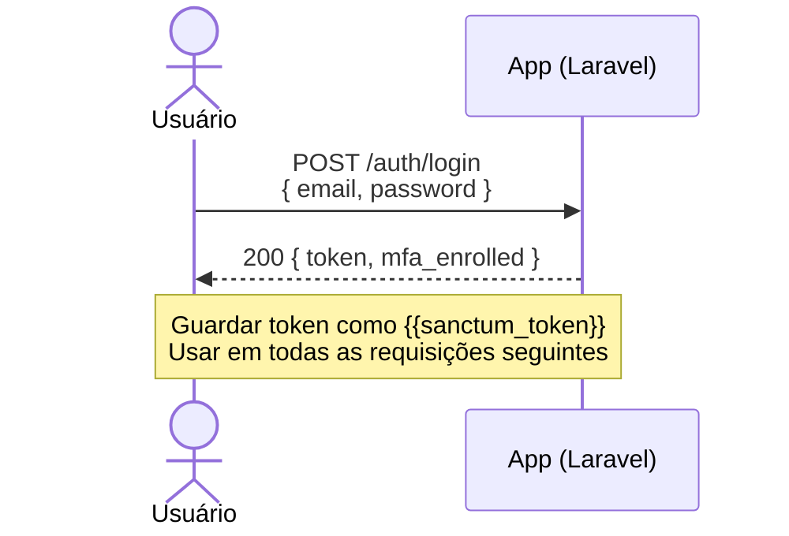
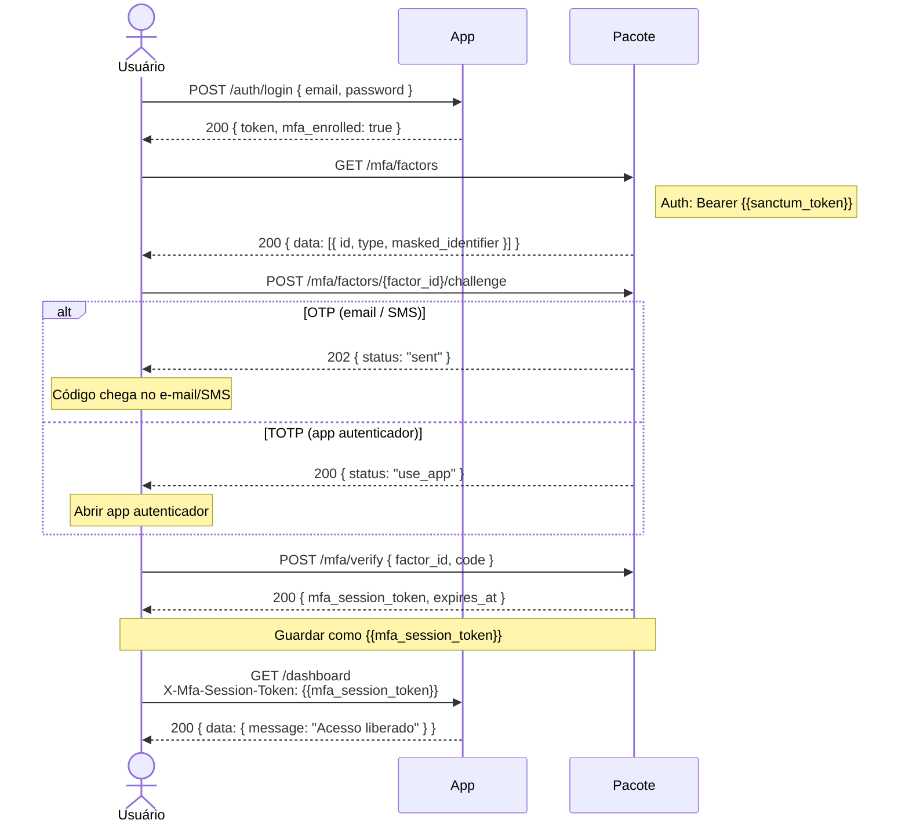
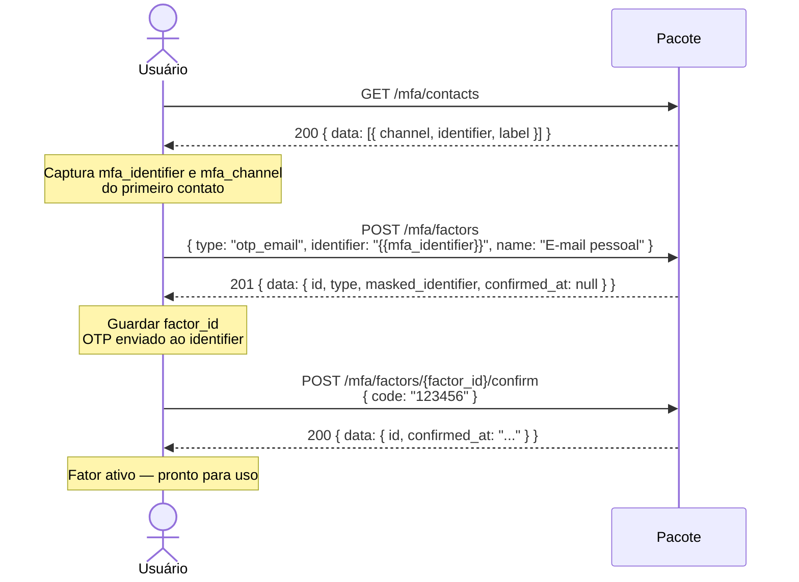
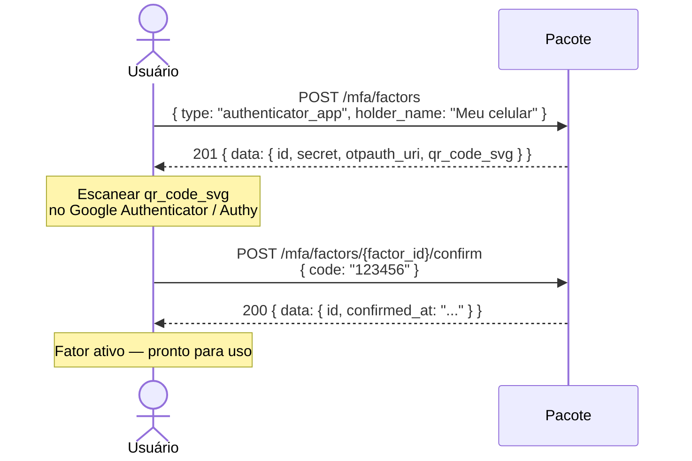
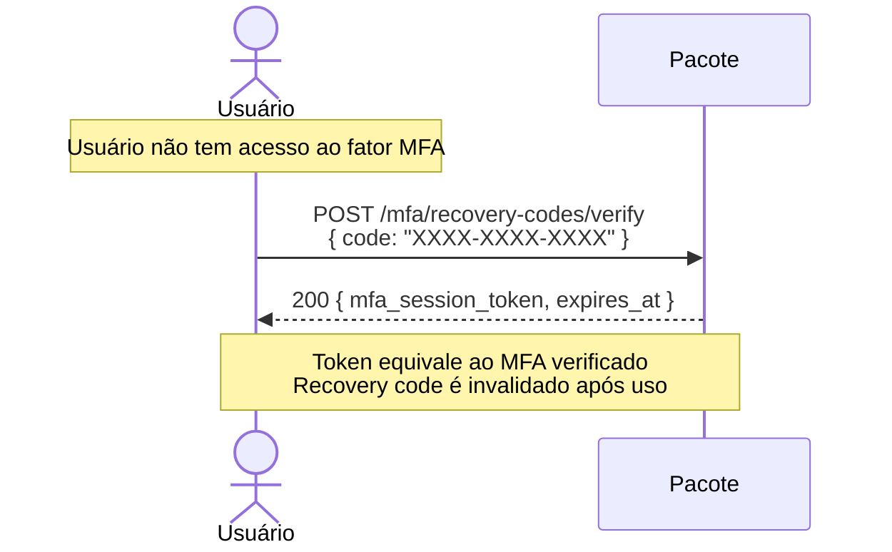
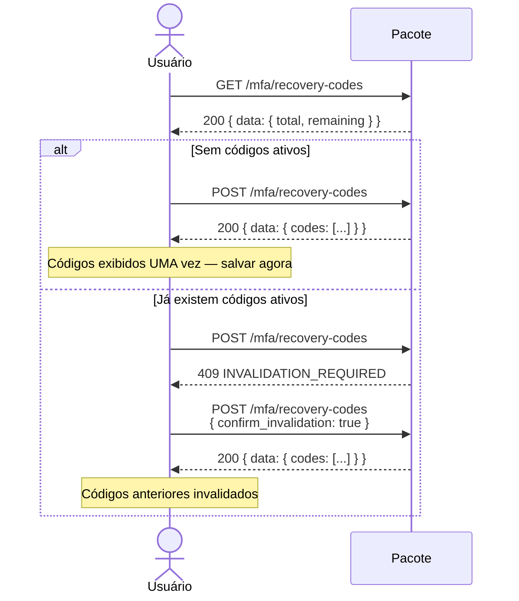
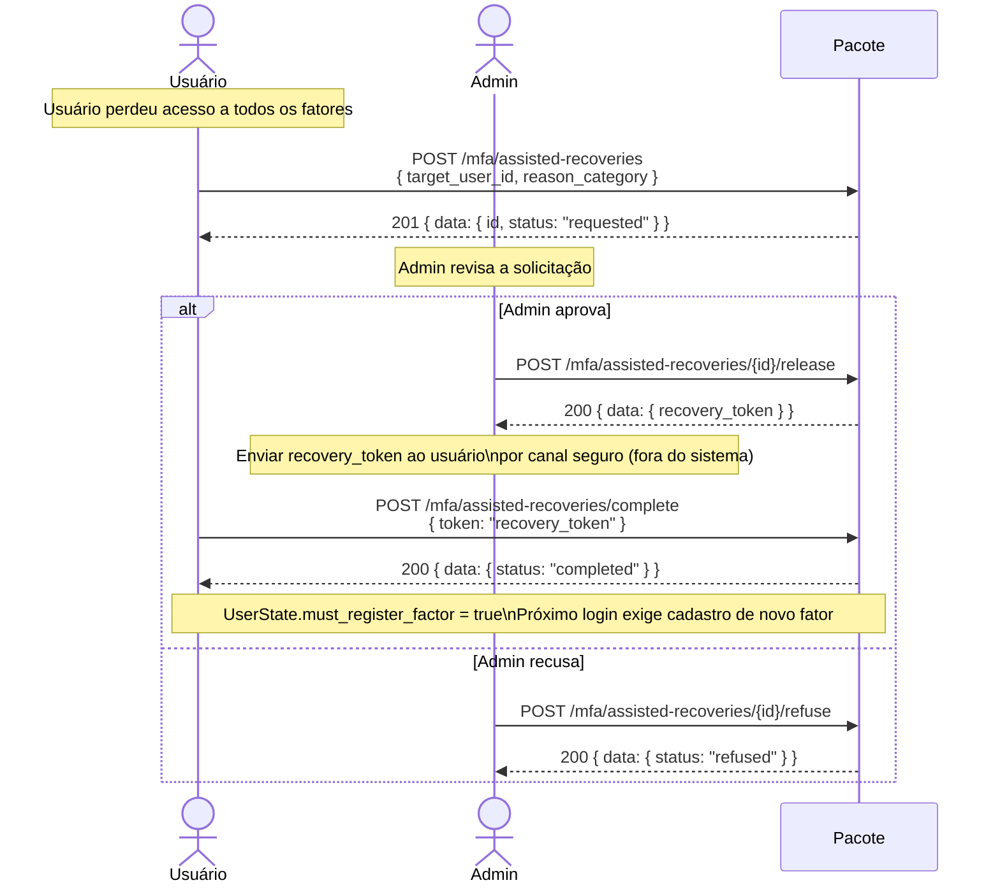

# Fluxo de rotas — ae3/auth-security

Referência visual dos fluxos cobertos pela coleção Postman.  
Cada seção corresponde a uma pasta da coleção.

---

## 0. Sandbox auth — obter token Sanctum



---

## 1. Fluxo completo de login com MFA



---

## 1a. Cadastro de fator OTP (e-mail)



---

## 1b. Cadastro de fator TOTP (app autenticador)



---

## 2. Verificação MFA (Challenge → Verify)

> Fluxo executado durante o login quando o usuário **já tem fator cadastrado**.

```mermaid
flowchart TD
    A([Usuário logado\ncom Sanctum token]) --> B[GET /mfa/factors]
    B --> C{Escolher fator}

    C -->|OTP email/SMS| D[POST /mfa/factors/{id}/challenge]
    D --> E[Aguarda código chegar]
    E --> F[POST /mfa/verify\ncode: XXXXXX]

    C -->|TOTP app| G[POST /mfa/factors/{id}/challenge]
    G --> H[Abre app autenticador]
    H --> F

    C -->|Fallback - outro fator| I[GET /mfa/factors/alternatives]
    I --> C

    F --> J{Código correto?}
    J -->|Sim| K([X-Mfa-Session-Token\nRetornado])
    J -->|Não| L{Tentativas restantes?}
    L -->|Sim| F
    L -->|Não| M([Conta bloqueada\n403 ACCOUNT_LOCKED])

    K --> N[Requisições com\nX-Mfa-Session-Token]
```

---

## 2a. Recuperação via recovery code (sem acesso ao fator)



---

## 3. Geração de códigos de recuperação



---

## 4. Recuperação assistida (admin libera acesso)



---

## 5 & 6. Políticas e senha

Fluxos simples — sem ramificações.

| Ação | Endpoint | Método |
|---|---|---|
| Consultar política | `GET /organization-policies?tenant_type=&tenant_id=` | Leitura |
| Criar/atualizar política | `PUT /organization-policies` | Escrita (admin) |
| Alterar senha | `POST /password { current_password, password, password_confirmation }` | Escrita |

---

## Sequência recomendada para testes no Postman

```
0. POST /auth/login                         → captura sanctum_token
                                              (cookie auto: se mfa_enrolled=false, pule 1→2)

1. GET  /mfa/contacts                       → captura mfa_identifier, mfa_channel
2. POST /mfa/factors                        → captura factor_id (tipo otp_email)
3. POST /mfa/factors/{factor_id}/confirm    → ativa o fator

   -- encerrar sessão e logar de novo --

4. GET  /mfa/factors                        → confirmar fator aparece listado
5. POST /mfa/factors/{factor_id}/challenge  → OTP enviado
6. POST /mfa/verify                         → captura mfa_session_token

7. GET  /dashboard (ou rota protegida)      → acesso com X-Mfa-Session-Token ✓
```
